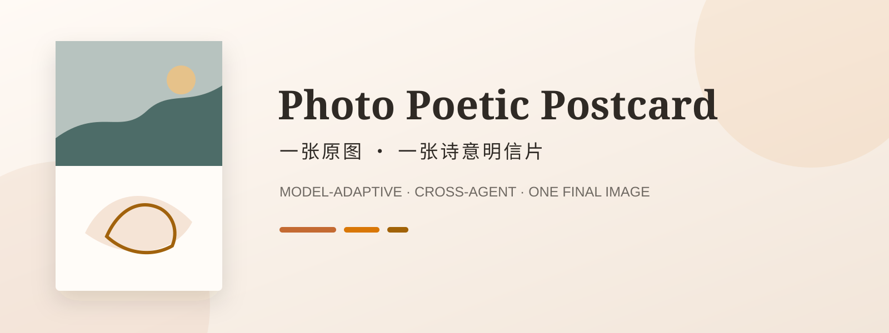
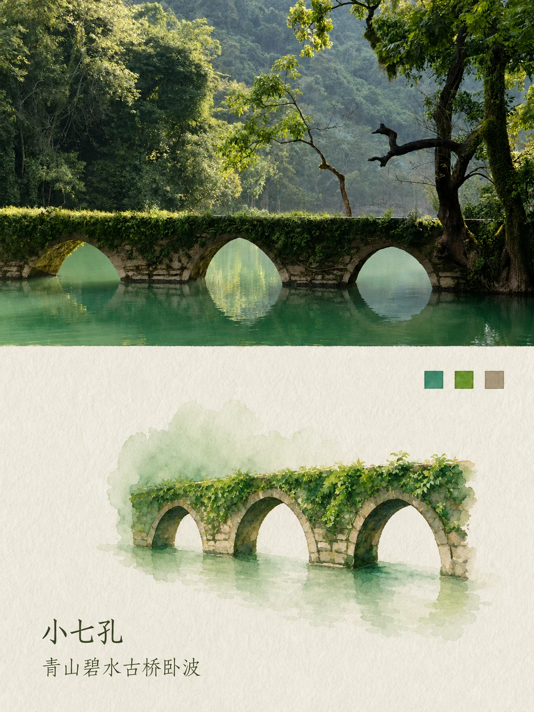
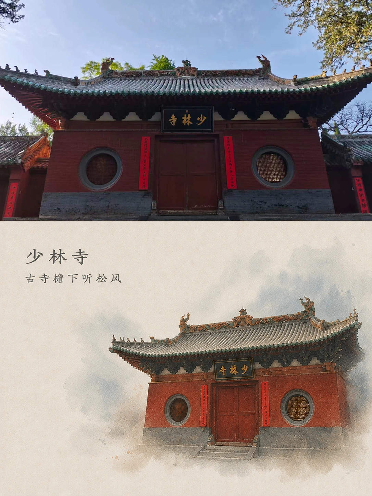
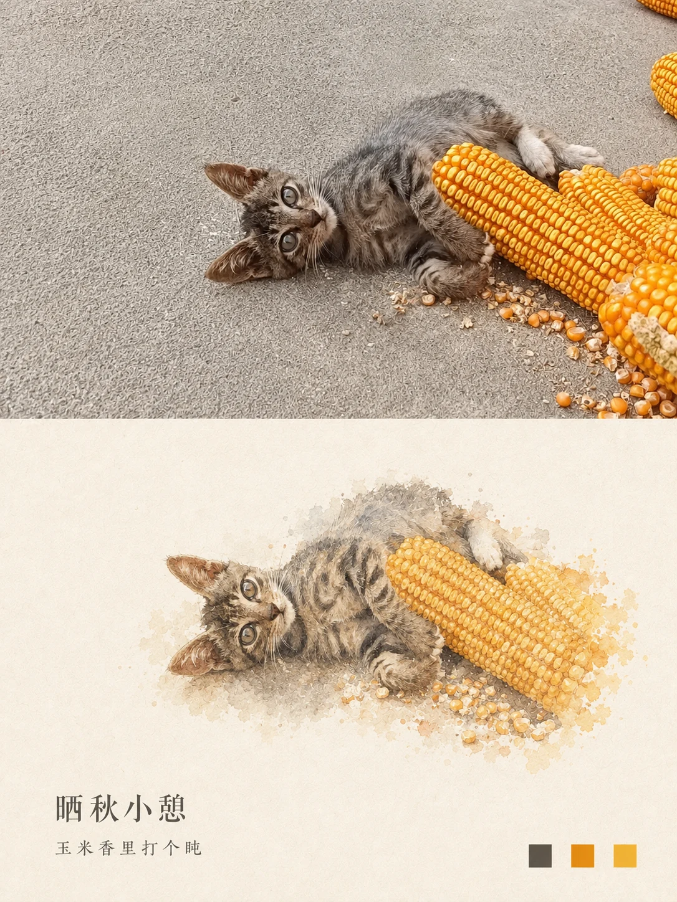
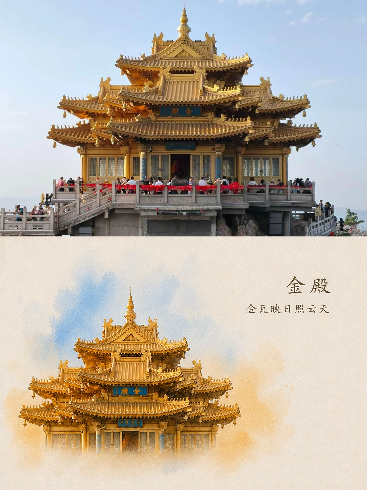
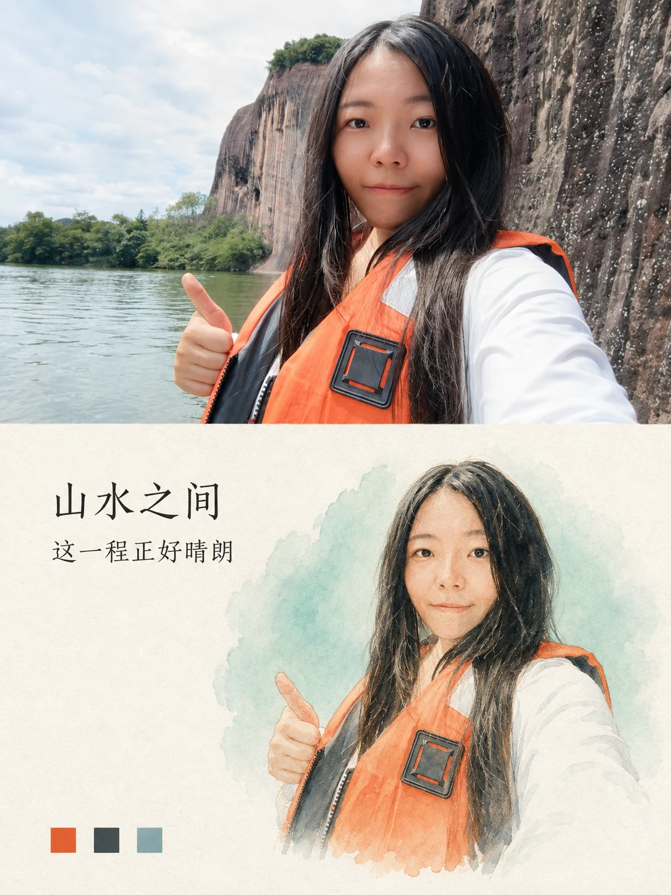
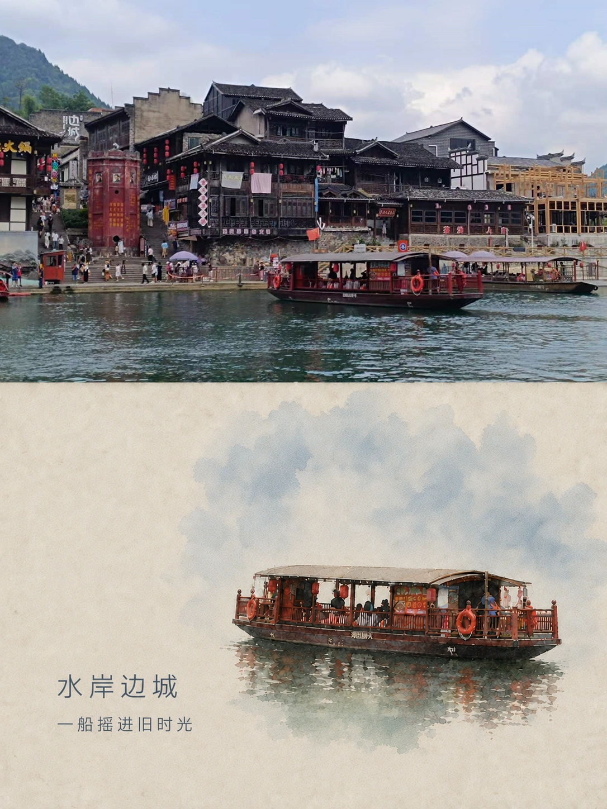

## 作者介绍

作者：AI尹小歪

中国美术学院AI中心特聘讲师  
WaytoAGI 认证讲师 & 视频学社主理人 & AI工具测评专家  
资深AIGC实战创作者、企业AI培训讲师

赛博吉他歌手

🔯为你挖掘各种AI效率工具  
📘保姆级教程带你拆解AI工具热门玩法

欢迎关注我的两个内容入口：公众号看完整图文拆解，视频号看工具实测与案例演示。

<table>
  <tr>
    <td align="center" valign="top" width="50%">
      <strong>微信公众号｜小歪的AI工具箱</strong><br>
      AI 资讯、保姆级教程与完整图文拆解<br><br>
      <a href="assets/images/wechat-qr.png"></a>
    </td>
    <td align="center" valign="top" width="50%">
      <strong>视频号｜AI尹小歪</strong><br>
      AI 工具实测、案例演示与视频教程<br><br>
      <a href="assets/images/wechat-channels-qr.jpg"></a>
    </td>
  </tr>
</table>

我的个人专栏：https://waytoagi.feishu.cn/wiki/Pddywh6NqiRKb4kaJBscAbf9nUA

---



# Photo Poetic Postcard｜照片诗意明信片 Skill

[English](README_EN.md)


把一张用户照片制作成一张完整的诗意明信片：上方保留原摄影，下方只提取其中一个主元素进行艺术转绘，并配以克制的标题、短注与取色色卡。

这不是绑定某一个模型的提示词，也不要求一次生成多张候选。它是一套可安装、可直接复制、可降级运行、可二次定义的跨 Agent 工作流。

## 效果图展示

以下均为授权原图在一次完整生图操作中得到的实测成品，不是先生成下半图再拼接，也没有事后用程序添加文字。六张成品均已核验为 `1086 × 1448`，精确 3:4。点击每张下方的“查看原图”可对照内容提取方式；完整案例记录见 [examples/README.md](examples/README.md)。

<!-- GALLERY:START -->
<table>
  <tr>
    <td width="33%" align="center"><br><strong>01 · 小七孔</strong><br><a href="examples/gallery/sources/case-01-xiaoqikong-source.webp">查看原图</a></td>
    <td width="33%" align="center"><br><strong>02 · 少林寺</strong><br><a href="examples/gallery/sources/case-02-shaolin-source.webp">查看原图</a></td>
    <td width="33%" align="center"><br><strong>03 · 玉米旁的小猫</strong><br><a href="examples/gallery/sources/case-03-kitten-source.webp">查看原图</a></td>
  </tr>
  <tr>
    <td width="33%" align="center"><br><strong>04 · 金殿</strong><br><a href="examples/gallery/sources/case-04-golden-hall-source.webp">查看原图</a></td>
    <td width="33%" align="center"><br><strong>05 · 水上人物</strong><br><a href="examples/gallery/sources/case-05-portrait-source.webp">查看原图</a></td>
    <td width="33%" align="center"><br><strong>06 · 水岸游船</strong><br><a href="examples/gallery/sources/case-06-riverside-source.webp">查看原图</a></td>
  </tr>
</table>
<!-- GALLERY:END -->

## 它解决了什么

- 一张原图只交付一张最终成品，不生成四张候选或四宫格。
- 不把下半区做成整幅照片的水彩复刻，只转绘一个主元素。
- 采用“拆解 → 选择性保留 → 蒸馏 → 重构”：只保留主体和零至三个直接相连的辨识线索，明确删除可识别的完整背景。
- 不写死 Image Gen、即梦、豆包或其他模型，根据当前 Agent 的真实能力选择执行方式。
- 有生图能力时直接生成；没有生图能力时输出一条已经分析并填好的完整提示词。
- Agent 无法安装 Skill 时，可直接使用独立的中英文 Prompt MD。
- 先判断地点证据；已确认的地点或景点名称必须进入标题或短注，无法确认时才使用场景文案且不猜地名。
- 用户可调整尺寸、比例、转绘风格、排版、文字、纸张、色卡与配色倾向。
- 上方照片、下方转绘、纸张、文字、色卡与排版必须在同一次生图中完整生成，不允许后期拼接或程序排字。

## 能力与平台兼容

| 平台 / 场景 | 推荐方式 | 能否直接生图 | 说明 |
| --- | --- | --- | --- |
| Codex / ChatGPT 桌面端 | 安装标准 Skill | 取决于当前会话是否有图片理解与生成工具 | 有工具就生成；无工具则输出可复制提示词 |
| Claude Code | 复制到个人或项目 Skills 目录 | 取决于已接入的模型、MCP 或图片工具 | Skill 本身不强制指定供应商 |
| WorkBuddy | 上传专用 ZIP | 取决于工作区选择的模型或连接器 | 提供符合 WorkBuddy 元数据要求的发行包 |
| Gemini CLI | 从 Git 仓库安装 | 取决于当前工具配置 | 支持标准 Agent Skills 目录 |
| 其他支持 `SKILL.md` 的 Agent | 安装标准 Skill 或手动复制 | 取决于宿主能力 | 遵循开放 Agent Skills 基本结构 |
| 即梦 / 豆包等自带生图 Agent | 直接使用 Prompt MD | 通常可在产品内完成 | 暂不宣称支持 GitHub Skill 安装 |
| 普通生图工具 | 上传原图并复制完整提示词 | 是 | 若工具不能先分析图片，先让视觉 Agent 填好主体和颜色 |

> “Skill 可安装”和“宿主有生图模型”是两件事。本项目只规定工作流，不伪装宿主不存在的能力。

更详细的平台说明见 [安装与兼容指南](docs/INSTALLATION.md)。

## 使用方法

### 方式一：作为 Agent Skill 安装

#### Codex

在 Codex 中对 `$skill-installer` 说：

```text
请从 https://github.com/yinxiaowai/xiaowai-photo-poetic-postcard 安装这个 Skill。
```

也可手动克隆到用户 Skills 目录：

```bash
git clone https://github.com/yinxiaowai/xiaowai-photo-poetic-postcard.git ~/.agents/skills/xiaowai-photo-poetic-postcard
```

#### Claude Code

个人级安装：

```bash
git clone https://github.com/yinxiaowai/xiaowai-photo-poetic-postcard.git ~/.claude/skills/xiaowai-photo-poetic-postcard
```

项目级安装时，把目录放进：

```text
.claude/skills/xiaowai-photo-poetic-postcard/
```

#### Gemini CLI

```bash
gemini skills install https://github.com/yinxiaowai/xiaowai-photo-poetic-postcard.git --consent
```

#### WorkBuddy

从 GitHub Releases 下载 `xiaowai-photo-poetic-postcard-workbuddy.zip`，在 WorkBuddy 的 Skill 创建/上传入口导入。该包使用 `skills/xiaowai-photo-poetic-postcard/SKILL.md` 结构，并包含 WorkBuddy 要求的双语描述、版本与作者元数据。

安装后，上传一张照片并直接说：

```text
使用 xiaowai-photo-poetic-postcard 把这张照片制作成一张诗意明信片。
```

如果想微调：

```text
使用 xiaowai-photo-poetic-postcard，把这张照片制作成 4:5 竖版明信片。上方照片占 60%，下方改成淡墨加彩铅，不要色卡，标题写“海风经过”。最终只给我一张图。
```

### 方式二：把 MD 当作完整提示词直接使用

无需安装项目。上传一张照片，再把下面任一 MD 文件作为附件发送给 Agent，或复制全文到对话中：

| 语言 | 文件 |
| --- | --- |
| 中文 | [references/photo-poetic-postcard-prompt.zh-CN.md](references/photo-poetic-postcard-prompt.zh-CN.md) |
| English | [references/photo-poetic-postcard-prompt.en.md](references/photo-poetic-postcard-prompt.en.md) |

这也是即梦 Agent、豆包 Agent 或其他带生图能力但不支持 GitHub Skill 安装的平台的推荐方式。

每个文件都是可以单独执行的 **16 节绘图规范**：包含原图的双重角色、主体选择与删除判断、不同题材的取舍、上下分区、裁切冲突、媒介细节、尺度留白、纸底晕染、地点文案、文字布局、色卡布局、自由调整、能力适配、检查修正和最终交付。不需要填写模板，也不需要让 Agent 回到首页读取其他文件。

可直接说：“请按这份绘图规范处理我上传的照片。”未指定的主体位置、文字、配色与笔触由 Agent 根据照片判断。需要微调时，用自然语言补充即可，例如“下方更松弛一些，改用淡墨，不要色卡”。

如需了解一次具体任务如何落实规范，可选读 [荔波小七孔示例](references/example-xiaoqikong-compiled-prompt.zh-CN.md)。该示例不是方式二的必读文件，其地点、文案与配色只适用于对应照片。

## 跨 Agent 的执行设计

完整绘图规范负责说明判断方法；主 Skill 中的五段模板负责在调用独立图片模型时传递具体决定。方式二独立包含两者所需的信息：

1. 默认整张 3:4 画布严格分成上下各 50% 的两个独立区域。
2. 主 Skill 内嵌中文生图交接模板，同时要求完整读取绘图规范；方式二不依赖其他文件。
3. Agent 必须先把“一个具体主体”和“本图具体删除清单”写进最终提示词；“整幅风景”或“同一场景”不能充当主体。
4. 调用图片模型时，保留分区和全部生效要求，将观察落实为本图的决定；不能概括到丢失规则。
5. 三枚色卡被写成可检查的数字规则：每枚边长约为下半区宽度 `1/20`，等大、纯色、完美正方形。
6. 生成前核对实际生效的要求；用户选择无文字、无色卡或其他语言时，相应默认检查同步改变。

这些是执行规则与设计目标，不代表已在所有 Agent 或生图模型中通过实测。仓库校验可以检查文件和发行包，实际构图表现仍需在目标环境中验证。

## 三种运行结果

| 当前 Agent 的能力 | Skill 的行为 |
| --- | --- |
| 能看图 + 能生图 | 直接生成并交付一张最终图 |
| 能看图 + 不能生图 | 分析原图，返回一条已填好的完整生图提示词，不假装已生成 |
| 不能看图 | 明确说明缺少图片理解能力，不编造主体、颜色、地点或构图 |

无论 Agent 是否能够运行本地代码，都不得把成品拆成“下半区生图 + 本地拼接”。本项目要求模型一次生成完整构图；本地代码只负责仓库校验与发行包构建，不参与视觉成品制作。

## 可自由调整的部分

| 参数 | 默认 | 可以怎么改 |
| --- | --- | --- |
| 画布 | 3:4，1080×1440 | 4:5、1:1、9:16 或自定义像素 |
| 上下占比 | 严格各 50% | 用户可明确调整约 40%–65%；Agent 不得自行漂移；照片铺满顶部和左右边缘 |
| 转绘媒介 | 透明水彩 + 轻水粉 + 彩铅 | 水墨、版画、拼贴纸感、克制数字绘画等 |
| 主体尺度 | 中等偏小、随复杂度自适应 | 横向/复杂主体约占下方宽度 55%–70%；人物、动物、圆环等约 40%–55% |
| 主体位置 | 根据轮廓与负空间决定 | 可偏左、居中或偏右；至少保留约 45% 连续干净纸面 |
| 纸张 | 暖米白纤维纸 | 冷灰白、手工纸、平滑美术纸 |
| 文字 | 中文标题 + 短注 | 自定义文案、语言、字体，或完全去掉 |
| 色卡 | 三枚，在下半区四角中择空位成组放置 | 调整位置或隐藏；显示时仍是三枚纯色正方形，每枚边长约为下半区宽度 1/20 |
| 色彩 | 从原图取色、低饱和 | 更暖、更冷、单色强调，但仍可追溯到原图 |
| 排版 | 先排主体，再根据负空间放文字与色卡 | 两组可在下半区四角间变化，尽量分处不同角落，不遮挡主体 |

## 不建议改掉的核心原则

1. 原图始终是唯一内容来源，上半区照片不应被语义重画、扩展或补造。
2. 下半区只提取并转绘一个主元素，不把整幅原图重新画一遍。
3. 最终是一张完整作品，不输出候选合集。
4. 地点判断顺序为“用户明确提供 > 清晰招牌/EXIF/定位 > 高置信度唯一地标”；确认后必须在标题或短注中原样出现，不能确认时不猜地名。
5. 默认让上方照片铺满其区域，不留纸边、不加描边；比例不同时只做必要裁切，不拉伸、不扩图。
6. 默认输出必须通过真实像素比例检查；3:4 作品出现 2:3 尺寸时必须在生图阶段修复。

## 项目结构

```text
xiaowai-photo-poetic-postcard/
├── SKILL.md                         # 跨 Agent 主 Skill
├── agents/openai.yaml               # Codex / ChatGPT 展示信息
├── references/
│   ├── postcard-design.md           # 视觉系统、变量与失败修复
│   ├── photo-poetic-postcard-prompt.zh-CN.md
│   └── photo-poetic-postcard-prompt.en.md
├── tools/
│   ├── build_packages.py            # 构建标准版与 WorkBuddy ZIP
│   └── validate_repo.py             # 仓库检查
├── examples/                        # 经授权的原图与效果图
├── README.md
└── README_EN.md
```

## 构建与验证

```bash
python tools/validate_repo.py
python tools/build_packages.py
```

发行时会生成：

- `dist/xiaowai-photo-poetic-postcard-standard.zip`
- `dist/xiaowai-photo-poetic-postcard-workbuddy.zip`

## 许可证

本项目采用清晰的分层许可：

- `SKILL.md`、提示词、视觉规范、README 和其他文字内容：**CC BY-NC-SA 4.0**。允许署名、非商业使用、修改与分享；衍生内容需采用相同许可。商业使用请先取得作者授权。
- `tools/` 中的代码：**MIT License**。
- `assets/images/wechat-qr.png`、`assets/images/wechat-channels-qr.jpg`、作者身份素材，以及 `examples/` 中的用户原图和效果图：**不包含在上述开放许可中**，仅用于项目介绍与效果展示，除非对应文件另有说明。

完整范围见 [LICENSE](LICENSE)、[LICENSE-CODE](LICENSE-CODE) 与 [NOTICE.md](NOTICE.md)。因为核心提示词带有“非商业”限制，本项目更准确地说是“开放共享”；其中 MIT 代码部分属于标准开源软件。

## 致谢与反馈

如果你用它做出了喜欢的作品，欢迎在 GitHub Discussions 或 Issues 分享使用平台、参数与结果。提交公开案例前，请确认你拥有原图和人物肖像的必要授权。
